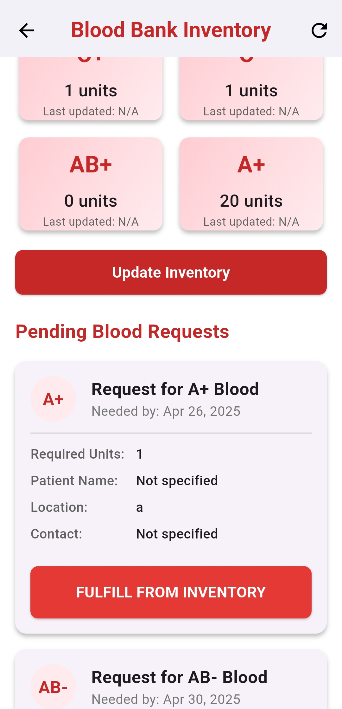

# Rakshak_admin
=======
# Rakshak - Blood Donation Management System

## Overview

Rakshak is a comprehensive blood donation management system that connects blood donors with recipients in need. The application facilitates blood donation requests, offers, and inventory management through a user-friendly mobile interface.

## Features

### User Features
- Create and manage blood donation requests
- Offer to donate blood for specific requests
- View donation offers for your requests
- Accept donations and mark them as completed
- Track personal donation history
- Real-time status updates on requests

### Admin Features
- Manage blood bank inventory
- View all blood requests
- Fulfill blood requests directly from inventory
- Track admin-fulfilled donations
- View analytics and inventory statistics

## Technology Stack

- **Frontend**: Flutter/Dart
- **Backend**: Supabase
- **Authentication**: Supabase Auth
- **Database**: PostgreSQL (via Supabase)
- **Storage**: Supabase Storage

## Installation

### Prerequisites
- Flutter SDK (latest stable version)
- Dart SDK
- Android Studio / VS Code
- Git

### Setup Instructions

1. Clone the repository:
   ```bash
   git clone https://github.com/ashishthipkurle/Rakshak_admin.git
   cd Rakshak
   ```

2. Install dependencies:
   ```bash
   flutter pub get
   ```

3. Run the application:
   ```bash
   flutter run
   ```

## Database Setup

### Supabase Configuration

1. Create a new project on [Supabase](https://supabase.com/)

2. Set up the following tables in your Supabase PostgreSQL database:

   For the database tables contect on this email:- ashishthipkurle1@gmail.com

3. Set up Row Level Security (RLS) policies for each table as needed

4. Add your Supabase URL and anon key to the project:
    - The URL and anonKey is in the admin_api.dart file.
    - Add the following:
      ```
      SUPABASE_URL=your_supabase_url
      SUPABASE_ANON_KEY=your_supabase_anon_key
      ```
      
## Usage

### User App
1. Register/Login using your email and password
2. Create a blood request when you need blood
3. View all requests and offer to donate for any matching request
4. Track your donations and requests in the profile section
5. Receive notifications for new offers and updates on your requests
6. Use Google Maps to find nearby blood banks in Blood bank section
7. View donation history and statistics in the profile section
8. View leaderboard to see your ranking among donors
9. View donation camps and events in the events section

### Admin App
1. Manage blood inventory and view stock levels
2. Fulfill urgent blood requests from inventory
3. Track all admin donations from the donation history screen
4. View analytics and statistics for blood donation trends
5. Add donation camps and events for users to see
6. Add donation to the users donation history
7. Add blood bank details to the blood bank section

## User App 

git clone https://github.com/ashishthipkurle/Rakshak.git


## Screenshots

### Admin Dashboard


### Add Events


### Add Blood Banks


### Add Donations


### Donation offers


### Accepted Donation


### Blood Inventory and Admin blood Fullfill List
 


### Donation History


## Contributors

- [Ashish Thipkurle](https://github.com/ashishthipkurle)


